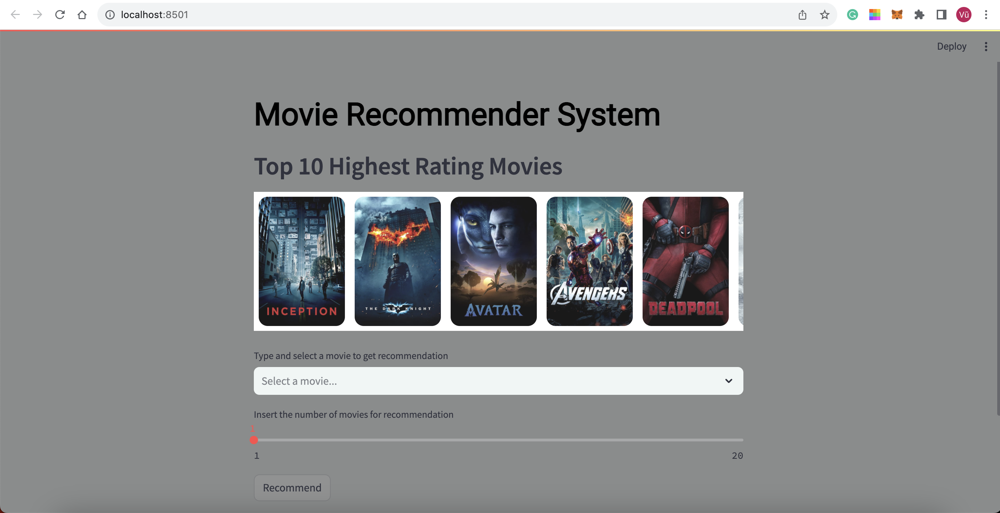
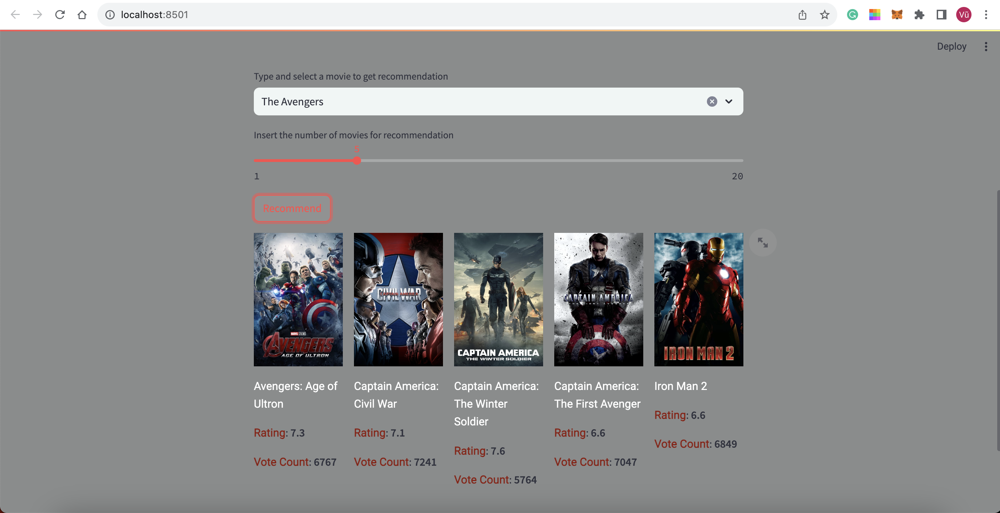
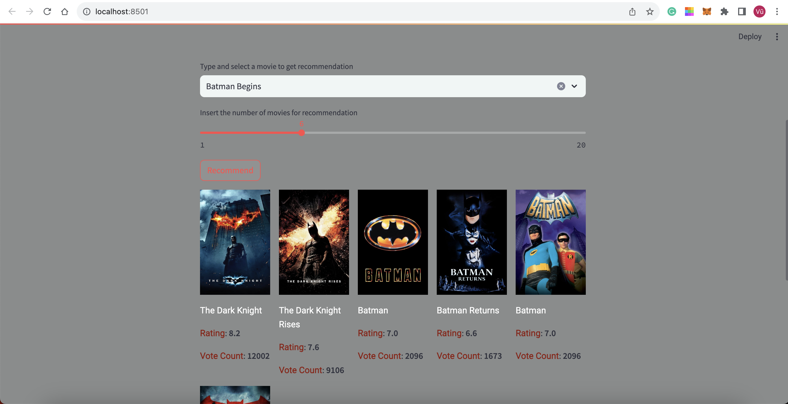
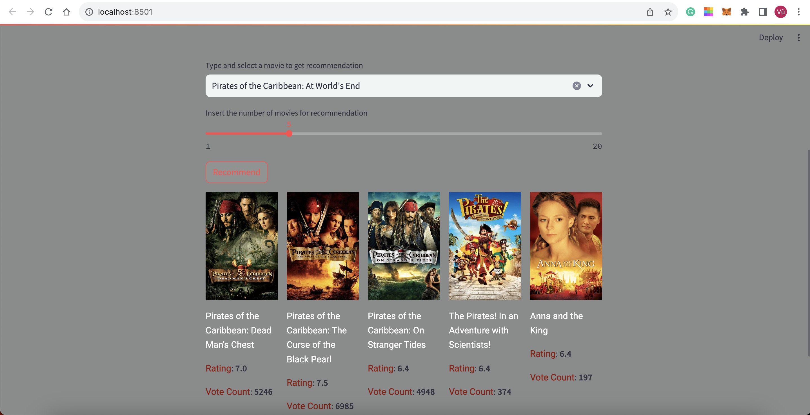

# Movie Recommendation System using Content-Based
I used Content-Based Method in order to create a Movies Recommender System. This is a web application that can recommend various kinds of similar movies

## Dataset has been used:

* [TMDB Dataset link](https://www.kaggle.com/tmdb/tmdb-movie-metadata?select=tmdb_5000_movies.csv)

## Demo:
<p align = "center">
    
</p>
<p align = "center">
    
</p>
<p align = "center">
    
</p>
<p align = "center">
    
</p>

## How to run the app
### STEPS:

Clone the repository

```bash
git clone https://github.com/VuBacktracking/Movie-Recommeder-System-Content-Based.git
```
### STEP 01- Create a conda environment after opening the repository

```bash
# you can use the other version of python but at least 3.7.10
conda create -n movie python=3.7.10 -y
```

```bash
conda activate movie
```


### STEP 02- install the requirements
```bash
pip install -r requirements.txt
```


```bash
#run this file to generate the models

Movie RecSys.ipynb
```

Now run,
```bash
streamlit run app.py
```

*Note*: My [`frontend`](https://github.com/VuBacktracking/Movie-Recommeder-System-Content-Based/tree/main/frontend) folder was donwloaded from https://github.com/DenizD/Streamlit-Image-Carousel
